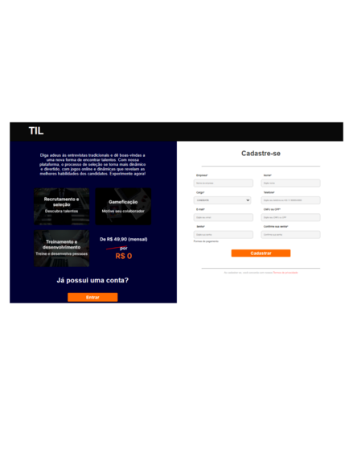

# Project title

Front-end TIL

# Tools used

 
 

Vite + ReactJS + Javascript

# Description

Project for TIL startup, creation of user login page.

---

**Screen 📷**

---

## Installation

`git clone https://github.com/ivanmartins090317/front-end.git`

after cloning the repository into yours where you copied it
`cd consume-mlb`

after that:
`npm install`

after that:
`npm run dev`

## Reference

[ReactJS] https://react.dev/learn

[useState] https://legacy.reactjs.org/docs/hooks-state.html

[useEffect] https://react.dev/reference/react/useEffect

[useContext] https://react.dev/reference/react/useContext

## Autores

- [Ivan Martins] https://ivanmartins090317.github.io/linktree/

## Project structure

Simple MVC project structure,
focus components and functional JS using SOLID base and Desin Pattern concepts.
